# Project
  

## 2016
#### [O2O Web Service PHP]
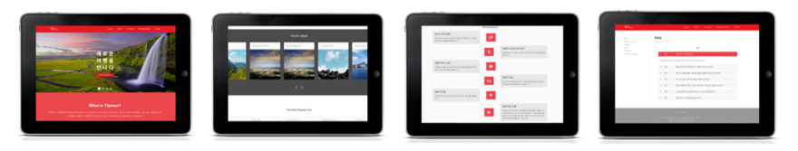
 

## 2015
#### [Android Application]
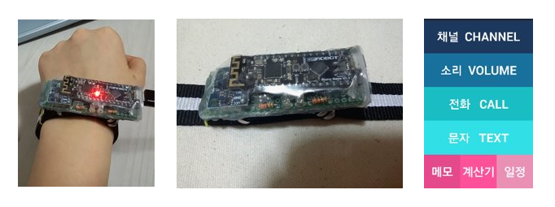
 
#### [Ball & Plate with Odroid]
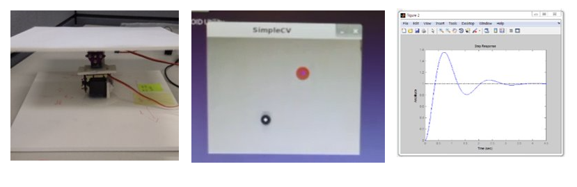
 
#### [Raspberry Pi Application : Team Project]
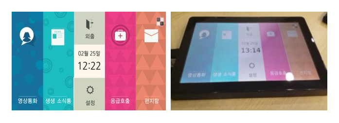
 

## 2014
#### [Android Application : Team Project]
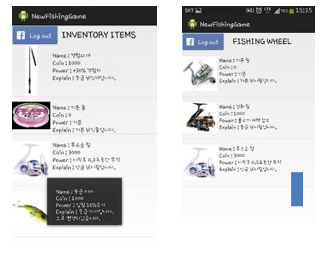
 
#### [Hand Detection with OpenCV]
[Project Link](./Hand_Detection_with_OpenCV&Magnetic_Lift)
 
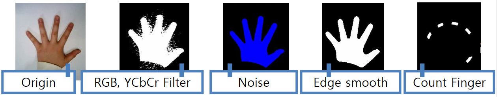
 
#### [AR Controller Ver2]
[Project Link](./AR_Controller_Ver2)
 

 
#### [AR Controller ver1]
[Project Link](./AR_Controller_Ver1)
 

 

## 2013
#### [Magnetic Tank]
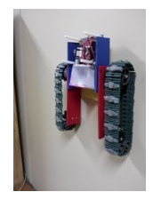
 
#### [Micromouse]
[Project Link](./Micromouse)
 
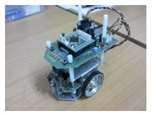
 
#### [Mission Impossible]
[Project Link](./Mission_Impossible_Ghost_Protocol)
 
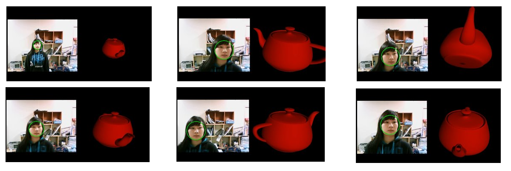
 

#### [Stair Climbing Robot : Team Project]
[Project Link](./Stair_Climbing_Robot)
 
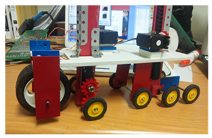
 

#### [Number Recognition Opencv]
[Project Link](./Number_Recognition_OpenCV)
 
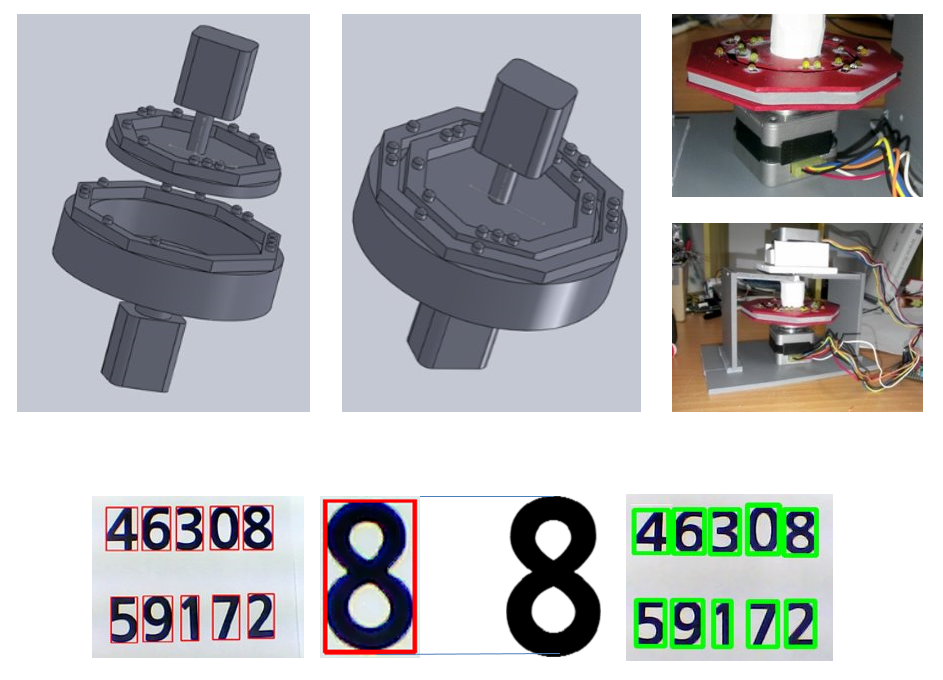
 

## 2010
#### [Dragoon : Team Project]
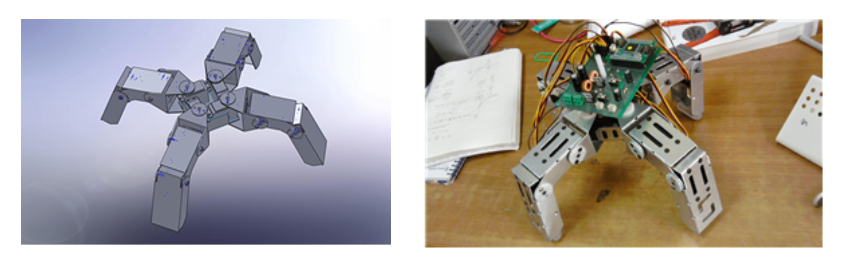
